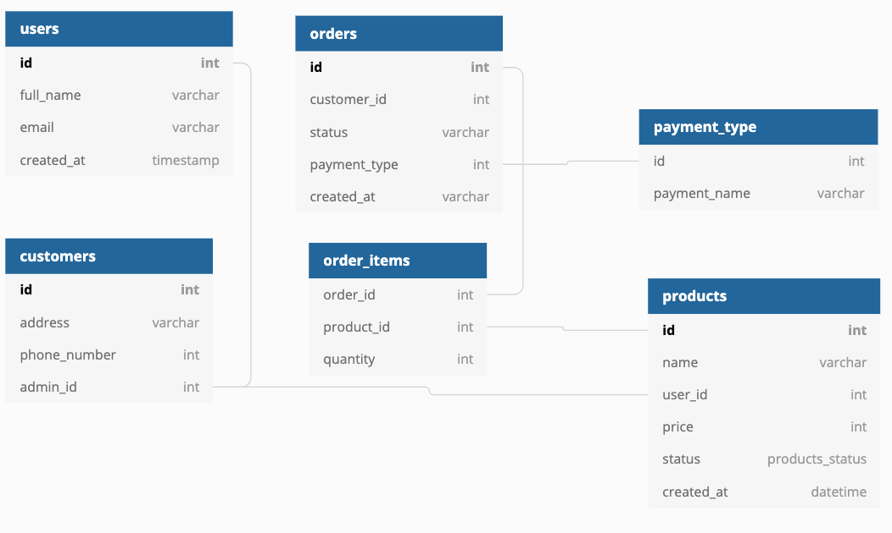

# ItsAlive

This web application is the source code for the Its Alive web site. It is powered by Python and Django.

## Link to ERD




# Installing Its ALive API

1. Clone the repo on to you local machine. CD into 'ItsAliveApi'

## Setup Virtual Environment

Enable a virtual environment at the level above this project. <br>

Use the following commands in your terminal:
```
virtualenv env
source env/bin/activate
```

2. Now you use pip to install all of the packages needed for this project.

`pip install django autopep8 pylint djangorestframework django-cors-headers pylint-django`


## Dependencies

Activate your vim and run `pip install -r requirements.txt`


2. Run makemigrations
`python manage.py makemigrations ItsAlive`

3. Run migrate
`python manage.py migrate`
>This will create all the migrations needed for Django Framework to post items to the database based on the models in the Models/ directory

4. Add initial data (For testing)
`python manage.py loaddata customers.json`
`python manage.py loaddata products.json`
This will load data from the project's json file to your local database

## Run Server

`python manage.py runserver `
Ctrl+C to quit

## Using the API
`http://localhost:8000` is the domain you will use to access the api.

